# C++

## C++基础

### 条件逻辑

```c++
if(condition){
code;
}
else if (condition){
code;
}
else{
code
} //一般逻辑

//条件运算符
// 表达式1 ? 表达式2 : 表达式3
max = ((a>b)?a:b);
//等价于
if(a>b){
    max = a;
}
else{
    max = b;
}

```

### 循环

```C++
for(int i, int j ... ;i<cond1, j<i ...;i++, j--){
    code;
}

while(condition){
    code;
    //先进行条件判断，满足后循环
}
do{code;}while(cond) //先运行一次代码，再判断条件
```

### 位运算符

```C++
&; //与
|;//或
^;//异或
~;//取反
```

### 数组

```c++
int a[10] = {...};//数组定义
int a[2][3] = {{1,2,3},{4,5,6}}
int a[2][3] = {1,2,3,4,5,6} // 二维数组定义,未初始化的值默认为0

#include<string> //字符串头文件
string s1 = "xxxxxx";
```

### 函数

**函数是面向过程的体现， 目的是将重复发生的过程进行统一描述，实现代码复用与解耦**

函数的引用传参，实际上就是给形参取别名

```c++
void swapByReference(int& a, int& b) {
    int temp = a;
    a = b;
    b = temp;
}//直接在原数据上进行操作，避免了大数据的拷贝
```

**PS** : 设置参数默认值时，应当从右向左设置

### 函数重载（overload）

- 避免重复书写相同的过程/流程代码，实现代码复用和解耦

- 同一套操作若要用在不同类型/数量的参数上，则需要编写不同函数

- 允许多个同名函数存在，分别处理不同类型/数量的参数

```c++
int add(int a, int b){
    return a+b;
}
int add(int a, int b, int c){
    return a+b+c;
}
//编译器会根据实参类型/数量自动匹配调用哪个函数
```

  **注意**

- 如果调用时实参能匹配多个(＞1个)重载函数，则编译器遇到歧义，产生编译错误
- 不允许仅有返回值不同的函数重载：重载是针对参数列表的

**函数重载三要素** ①名称相同 ②参数列表不同 ③调用不产生匹配歧义

### 内联函数（inline）

当在一个函数的定义或声明前加上关键字inline则就把该函数定义为内联函数，其它与函数定义相同。

建议编译器在编译时将函数直接在调用处展开，避免函数调用行为的额外开销

并不是写了 inline 关键字就一定会被内联，只是提出建议，由编译器决定是否采纳

内联这个动作发生在编译时，提升运行时的效率

```c++
inline int getMax(int a, int b, int c){
    return a > b ? (a > c ? a : c) : (b > c ? b : c);
}
int main(){
    getMax(3,2,1);
    getMax(2,1,3);
    return 0;
}
```

### 全局变量与局部变量

定义变量即是在内存中开辟区间

- 根据变量的有效范围（作用域），将变量分为全局变量和局部变量
- 根据变量的存储特性（生存期），将变量分为静态存储变量和动态存储变量

**全局变量** 

全局变量的定义并不一定放在程序的前面，只要定义在函数外都是全局变量

如果想要在一个文件中使用另一个文件的全局变量，可以使用extern关键字

**局部变量**

- 定义在函数内部和复合语句中的变量为局部变量，或内部变量
- 在一个函数内部定义的变量，只在该函数范围内有效，其作用范围是从定义点处到函数末尾
- 特点
  - 局部变量只能在函数内部使用
  - 局部变量存放在动态存储区，当函数运行时分配空间，在运行结束时释放空间。
  - 局部变量必须先初始化才能使用。
  - 局部变量可以与全局变量同名，那么全局变量在函数中将不再起作用

**注意**

1. 在同一个源文件中，如果全局变量与函数的局部变量同名，在函数的局部变量的作用域内，同名的全局变量无效
2. 一个函数中既可以使用本函数中的局部变量，又可以使用有效的全局变量
3. 为了在函数体内使用与局部变量同名的全局变量，应在全局变量前使用作用域作用符“::”

### 函数的储存类别

1. 自动变量（auto）

   函数中的局部变量，如果不用关键字static加以声明，编译系统对它们是动态地分配存储空间的，关键字auto可以省略。

2. 静态局部变量（static）

   为静态变量赋初值是在编译时进行的，即只赋值一次，以后每次调用函数时不再重新赋值

3. 寄存器变量（register）由于编译器的进步，用处不大

4. 使用extern声明外部变量

   如果一个程序包含两个文件，在两个文件中都要用到同一个外部变量，不能在两个文件中各自定义，而只能在任意一个文件中定义，在另一个文件中用extern做外部变量说明
   
5. 静态全局变量

   在全局变量定义时前面加上static，使其只能在本文件中使用，避免使用了相同的全局变量而影响到程序的正确性

### 指针

1. 指针变量在未赋初值时不指向任何地址，因此指针变量也必须初始化后才能被引用
2. 在程序中参加数据处理的变量不是指针本身的变量，因为指针本身是个地址量。而指针所指向的变量，即指针所指向的内存区域中的数据（称为指针的目标）才是需要处理的数据

取地址运算符& : 返回变量的内存地址

间接访问运算符*：访问指针指向的变量

- *p可以访问p指向的值
- *&x和x是一样的

void* p的p不指向一个确定的类型数据，它的作用仅仅是用来存放一个地址，void指针可以指向任何类型的C++数据，即可以用任何类型的指针直接给 void指针赋值，如果需要将void指针的值赋给其他类型的指针，则需要进行强制类型转换

```c++
int a;
int*p1=&a ;
void *p2=p1;
int *p4=(int *)p2;
```

**指针运算**

指针运算是以指针变量所存储的地址值为运算量进行的运算。因此，指针运算的实质是地址的计算。包括算数运算与关系运算。

1. 指针加减数值：p±n 表示 p 向后/ 向前移动 n 个元素位置。
2. 指针减指针：如果两个指针px和py所指向的变量类型相同，则可以对它们进行相减运算。px-py运算的结果值是两指针指向的地址位置之间的数据个数

**数组指针** 数组元素值为指针的数组称为指针数组，常用于指向多个字符串

**指针数组** 一个指向数组的指针，即指向整个数组，若把一个指针定义为指向具有N个元素的一维数组的类型，并用一个列数为N的二维数组的数组名进行初始化，则该指针就指向了这个二维数组


## 面向对象

### 面向对象的特点

- 面向对象程序设计的特征是**封装性、抽象性、继承性和多态性**。
- 面向对象的程序主要由**类**和**对象**组成
- 类是实现数据抽象的工具，是对某一类具有相同属性和行为特征对象的抽象，同时定义了**数据的类型和数据的操作**，是实现面向对象的基础。

### 类的构成与定义

类是一种新的数据类型，它是C++的核心，是面向对象方法的基础

- 类和对象的关系：**类是对象的抽象，对象是类的实例**
- 先定义类，再定义该类类型的变量——对象
- 在C++中，由于类是一种用户自定义的数据类型，系统不会为其分配存储空间

```c++
class xxx{
    private:	//私有成员：只允许类内成员函数存取它
    public:		//公有成员：允许类内和类外函数存取它
    protected:	//保护成员：允许类内和其派生类函数存取它
}
```

### 类的成员函数

成员函数的实现，可以放在类体内，也可以放在类体外。如果放在类体外，必须在**类体内给出原型说明**

在类外对类成员函数的定义必须使用**运算符“::”**，称为作用域运算符（也称作用域分辨符）

### 类成员的访问权限

共有，私有，保护

- 公内成员可以相互访问
- 类外成员只能访问公有

```c++
x.data
```

**注意** 对象中的保护（protected）成员和私有（private）成员不允许被**非成员函数直接访问**，这称为类的封装性

### 公有成员的访问

- 对象名.公有成员
- 对象指针->公有成员
- &引用变量名=对象名

### 私有成员的访问

- 只允许**本类中的成员函数**访问类定义体内的私有数据成员、私有成员函数 ，任何外部函数（友元函数除外）都不能访问类体内的私有成员。
- 要访问类体内的私有数据成员，必须通过设置相应的**公有函数**，只能通过对象的公有成员函数来获取


### 构造函数

构造函数（Constructor）是一种特殊的**成员函数**，它是用来完成在声明对象的同时，对对象中的数据成员进行初始化

构造函数形式：**类名（形参表）；**

1. 构造函数是成员函数，函数名与类名相同
2. 当创建对象时，系统将自动调用构造函数
3. 构造函数允许为内联函数、重载函数、带默认形参值的函数
4. 构造函数可以有0个或多个参数
5. 不能定义返回值类型，不能指定为void，也不能有return语句
6. 若程序中未声明，系统自动产生一个默认形式的构造函数
7. 构造函数必须置于**类的public部分**

### 拷贝构造函数

- 拷贝构造函数又称复制（copy）构造函数。
- 对象具有复制机制，用一个已有的对象可快速复制出多个完全相同的对象，其可以用一个已定义并初始化的对象进行同一类的其他对象的构建及初始化。
- 是一种特殊的**构造函数**

1. 自定义的拷贝函数

   

2. 拷贝构造函数调用的三种情况
   - 当用类的一个对象去初始化该类的另一个对象时系统自动调用拷贝构造函数实现拷贝赋值
   - 若函数的形参为类对象，调用函数时，系统处理成用实参对象初始化形参对象，自动调用拷贝构造函数
   - 如果函数的返回值是类的对象，函数执行完成返回主调函数时，将使用return语句中的对象初始化一个临时无名对象，传递给主调函数， 此时发生拷贝构造

**当类中有动态申请的数据空间时，必须定义拷贝构造函数，否则出错**

#### 深拷贝

当类的数据成员中有指针类型时，就必须定义一个特定的拷贝构造函数，该拷贝构造函数：

- 不仅可以实现原对象和新对象之间数据成员的拷贝
- 而且可以为新的对象分配单独的内存资源

**何时必须定义拷贝函数**

1. 若只需拷贝同类型对象的部分数据成员
2. 或者类中的某个数据成员是使用 new 运算符动态地申请存储空间进行赋初值时

同时应显式定义相应的**析构函数**，撤消动态分配的空间

### 析构函数

析构函数(Destructor) 与构造函数相反，完成对象被删除前的一些清理工作

- 功能：当对象的生命期即将结束时（系统释放对象所占的空间之前），系统会调用该对象的析构函数，析构函数执行完后，系统释放该对象所占用的内存空间。
- 在对象中如果有使用new申请的空间，且当对象空间被回收前仍未被释放的，应当在析构函数中，使用delete释放该空间
- 多个对象处于同一作用域时，先构造的对象后析构

```c++
//析构函数结构
<类名>::~<析构函数名>(){函数体}
```

默认析构函数是一个空函数。

1. 析构函数的函数名与类名相同
2. 在函数名前面**添加“～”符号**，用以区分构造函数
3. 析构函数**不返回任何值，没有函数类型，没有函数参数**
4. 一个类只能定义一个析构函数，即**析构函数不允许重载**
5. 析构函数在声明类时定义，如果用户没有定义，C++编译系统会自动生成一个默认的析构函数
6. 析构函数可以被显式调用，也可以由系统自动调用。 在下面两种情况下，析构函数会被自动调用
   - 当对象是系统自动创建的，则在对象的作用域结束时，系统自动调用析构函数
   - 当一个对象是使用new运算符被动态创建的，在使用delete运算符释放它时，delete将会自动调用析构函数

7. 具有static属性的对象（静态对象）在函数调用结束时该对象并不释放，因此也不调用析构函数。只在**main函数结束**或**调用exit函数**结束程序时，其生命期将结束，这时才调用析构函数

8. 全局对象，在main函数结束时，其生命期将结束，这时才调用其的析构函数


### 类的组合

类A中的数据成员是另一个类B的对象。则该类A的对象称为组合对象，可以实现层级更高的抽象

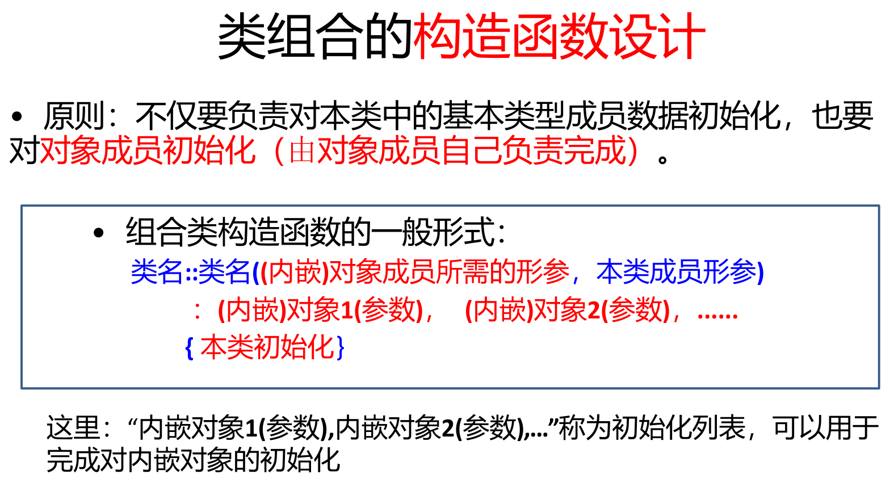

#### 组合对象的初始化顺序

首先对构造函数初始化列表中列出的成员（包括基本类型成员和对象成员）进行初始化，初始化次序是成员在类体中定义的次序

1. 成员对象构造函数调用顺序：按对象成员的声明顺序，先声明者先构造
2. 初始化列表中未出现的成员对象，调用用默认构造函数（即无形参的）初始化

#### 构造函数与析构函数的调用顺序

构造函数的执行次序是先遇到哪个构造函数，就执行哪个。析构函数的执行次序恰好和构造函数相反。

### 对象数组

对象数组就是数组里的每个元素都是类的对象

```c++
//定义
类名 数组名[元素个数]
```

### 对象指针

对象的起始地址即是对象的指针，格式为**类名 *对象指针名**

使用指针访问成员时：

- 对象指针名->数据成员;
- 对象指针名->成员函数(实参列表);

同一般变量的指针一样，对象指针在使用之前必须先进行初始化。可以让它指向一个已定义的对象，也可以用new运算符动态建立堆对象。

### this指针

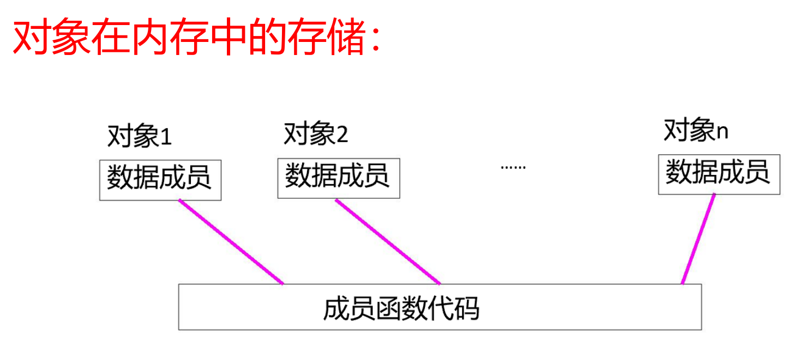

同类的对象在调用同一个成员函数时，实际上是调用同一段函数代码。

成员函数为了操作指定对象的数据成员，必须要与当前正在被操作的对象建立某种联系。C++中设立了一个this指针，将成员函数和正在被该成员函数操作的对象联系起来

- 该指针是系统自动产生的，不需要定义
- 并且它是常量指针，不能被赋值和修改，只能使用它（即this指针的值不能改变，它指向的值可以改变）
- 友元函数没有 this 指针，因为友元不是类的成员。只有成员函数才有 this 指针。

### 向函数传递对象

- 按值传递
- 指针传递
- 引用传递

### 类的静态成员

静态成员：类属性，存储在静态区

**必须对静态成员类外初始化**

有些情况下，可能希望有某一个或几个数据成员为同一个类的所有对象共有,也就是实现数据共享

静态数据成员是类的属性，这个属性不属于类的任何对象，但所有通过该类实例化的对象都可以访问和使用它。即静态数据成员是所有对象所共享的成员，而不是属于某个对象的成员。

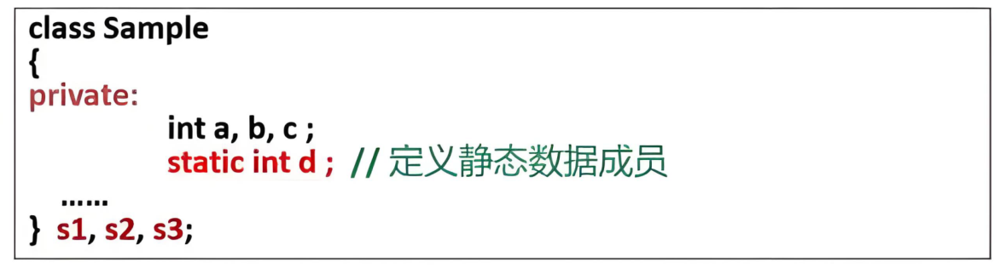

静态数据成员的初始化

1. 静态数据成员**不能在类的构造函数中初始化**，也不用参数初始化表对静态数据成员初始化。
2. 静态数据成员也不可在**类体内进行赋初值**
3. 静态数据成员的初始化工作只能在**类外**，并且在**对象生成之前**进行；进行一次且只能作一次定义性说明。

#### 静态成员函数与非静态成员函数之间的访问

核心源于是否拥有this指针以及成员的归属

1. 静态成员函数访问非静态成员

   不能直接访问，必须通过对象、对象指针或对象引用来访问

2. 非静态成员函数访问静态成员

   可以直接访问

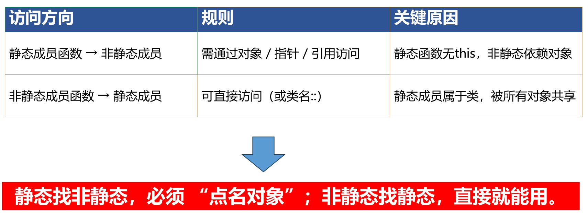

### 类的友元

C++为了进一步提高数据共享，通过友元机制实现类外数据共享

- **友元不是该类的成员函数，但是可以访问该类的私有成员**
- 友元的作用在于提高程序的运行效率，但是，它破坏了类的封装性和隐藏性，使得非成员函数可以访问类的私有成员。
- 对于一个类而言，它的友元是一种定义在该类外部的，但需要在该类体内进行说明的：
  - 普通函数
  - 另一个类的成员函数
  - 另一个类

当友元是一个函数时，称该函数为友元函数，当友元是一个类时，称该类为友元类。

#### 友元函数

- 友元函数不是当前类中的成员函数，它既可以是一个不属于任何类的一般函数，也可以是另外一个类的成员函数
- 将一个函数声明为一个类的友元函数后，它不但可以通过对象名访问类的公有成员，而且可以通过对象名访问类的私有成员和保护成员
- 访问对象中的成员必须通过对象名。通过参数（如A& a）关联到具体对象，才能访问其成员
- 友元函数近似于普通的函数，它不带有this指针，因此必须将对象名或对象的引用作为友元函数的参数，这样才能访问到对象的成员。

声明非成员函数作为友元函数的语句格式为：
**friend 返回值类型 函数名（参数表）;**
通过参数（如A& a）关联到具体对象，才能访问其成员

#### 友元函数与一般函数的区别

1. 友元函数**必须在类的定义中说明**，其函数体可在类内定义，也可在类外定义
2. 友元函数可以访问该类中的所有成员（公有的、私有的和保护的），而一般函数只能访问类中的公有成员

#### 类的成员函数作为友元函数

一个类的成员函数作为另一个类的友元函数的语句格式为
friend 返回值类型 类名::函数名（参数表）；

大多数情况是友元函数是某个类的成员函数，即A类中的某个成员函数是B类中的友元函数，这个成员函数可以直接访问B类中的私有数据。这就实现了类与类之间的沟通

#### 友元类

1. 一个类可以作为另一个类的友元
2. 当一个类作为另一个类的友元时，就意味着这个类的所有成员函数都是另一个类的友元函数 。

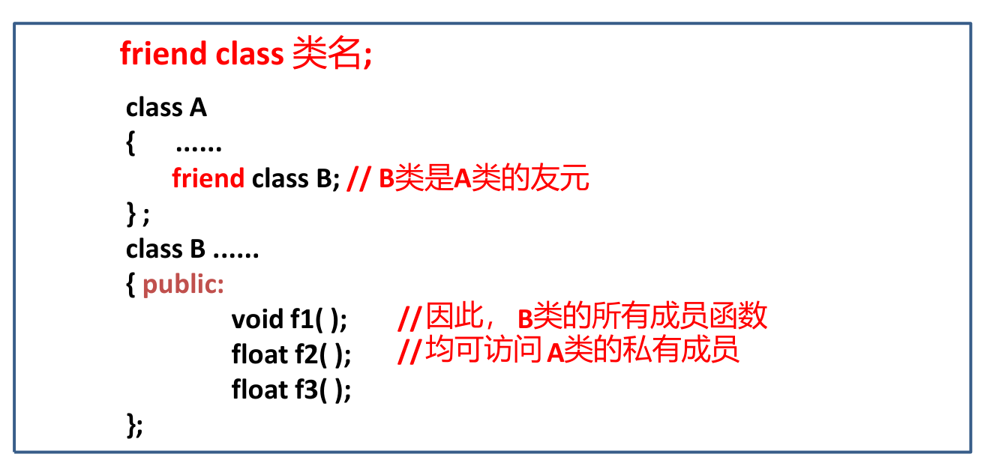

- 友元关系不可以被继承
- 友元关系是单向的
- 友元关系不能传递

### 数据的保护

对于既需要共享、又需要防止改变的数据应该声明为**常量**

定义或说明常量时必须对其进行初始化。类型修饰符**const**。

### 继承与派生

继承与派生是面向对象程序设计中最重要的机制，允许程序员在保持原有类特性的基础上，进行更加具体而详细的说明，从而实现对类的扩充。

#### 什么是继承和派生

C++中，继承和派生是指在已有类的基础上**新增自己的属性和方法**而产生新类的过程

- 被继承的已有类称为基类（base class）或父类（father class）
- 派生出的新类称为派生类（ derived class ）或子类（ son class ）

继承与派生是同一过程从不同的角度看

- 保持已有类的特性而构造新类的过程称为继承（inherit）
- 在已有类的基础上新增自己的特性而产生新类的过程称为派生（derive）
- 子类继承了父类，父类派生了子类

#### 派生类的声明

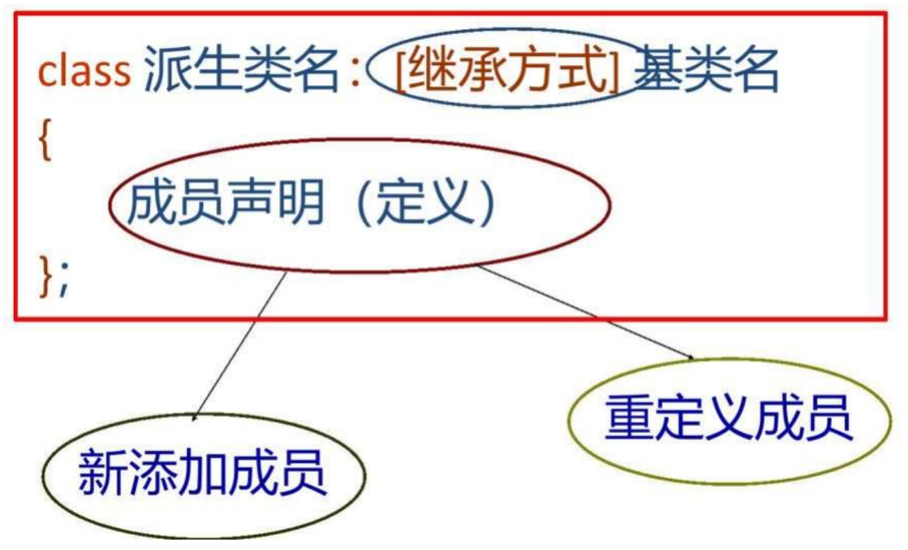

#### 派生类的构成

C++允许派生类：

- 继承或修改基类的部分或全部属性和行为，
- 增加基类中没有的新的属性和行为。

1. 派生类把基类的全部成员（不包括构造函数和析构函数）接收过来
2. 调整从基类接受的成员
   - 改变基类成员的访问权限
   - 当派生类与基类有相同的成员时，实现对基类成员的隐藏
3. 在声明派生类时增加新的成员。
4. 定义派生类的构造函数和析构函数（当然也可以使用默认的）。

#### 继承的种类

C++中，一个派生类可以从一个基类派生，也可以从多个基类派生。从一个基类派生的继承称为单继承；从多个基类派生的继承称为多继承。

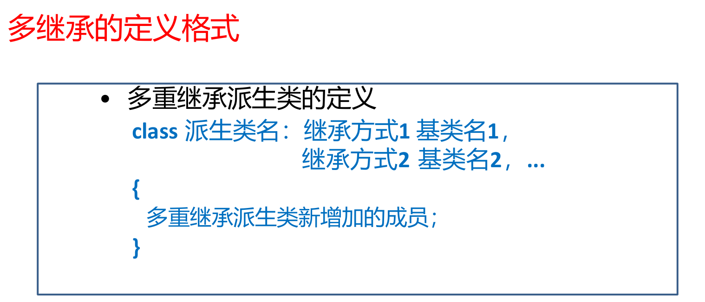

注意：每一个“继承方式”，只用于**限制对紧随其后之基类的继承**。

#### 派生类的三种继承方式

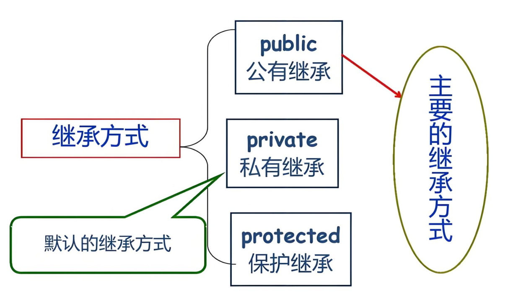

不同继承方式的影响主要体现在

- 派生类成员对基类成员的访问权限
- 通过派生类对象对基类成员的访问权限

1. 共有继承（public）

   基类的public和protected成员在派生类中的访问权限保持不变，基类的private成员在派生类中不可直接访问

   - 基类public/protected成员在派生类中权限不变
   - 基类private成员派生类不可直接访问（需间接访问）
   - 类外仅能访问派生类中继承的public成员

2. 私有继承（private）
   - 派生类内部可访问基类原public/protected成员（现为private）；
   - 派生类对象无法访问任何继承的基类成员；
   - 派生类的子类（孙子类）无法访问这些成员（权限终止于当前派生类）
   - 可以在派生类中定义共有成员函数来访问基类私有成员

3. 保护继承（protected）
   - 派生类内部可访问基类原public/protected成员（现为protected）
   - 派生类对象无法访问任何继承的基类成员（包括原public）
   - 派生类的子类（孙子类）可访问这些protected成员（权限传递）

#### 单继承

一个子类只有一个直接父类时称这个继承关系为单继承；

基类的构造函数和析构函数是不能被继承的，需要在派生类中重新定义

由于派生类继承了基类的成员，在初始化时，也要**同时初始化基类成员**。可通过调用**基类的构造函数**完成初始化

C++提供一种机制，使得在创建派生类对象时，能够调用基类的构造函数来初始化基类数据，即：

1. 声明派生类构造函数时，只需要对本类中新增成员进行初始化，而对继承来的基类成员的初始化，自动调用基类构造函数完成。
2. 派生类的构造函数必须负责调用基类构造函数使基类的数据成员得以初始化，需要给基类的构造函数传递参数。
3. 当基类中声明有默认形式的构造函数或未声明构造函数时 ，**派生类构造函数可以不向基类构造函数传递参数**。
4. 若基类中未声明构造函数，派生类中也可以不声明，全采用缺省形式构造函数。
5. 当基类声明有带形参的构造函数时，派生类也应声明带形参的构造函数，并将参数传给基类构造函数。

```c++
//10-2.1：单继承的构造函数及析构函数应用
#include <iostream>
#include <string>
using namespace std;

class Student
{
public:
	Student(int n, string nam, char s)  //定义基类构造函数
	{
		num = n;
		name = nam;
		sex = s;
	}
	~Student(){}     //基类析构函数	
	int getNum()
	{
		return num;
	}
	string getName()
	{
		return name;
	}
	char getSex()
	{ 
	    return sex;
	}

protected:           //基类保护成员
	int num;
	string name;
	char sex;
};

class Student1 :public Student  //公有继承
{
public:
	Student1(int a, string ad, char s, int n, string nam) :Student(n, nam, s)
	{
		age = a;
		addr = ad;
	}
    //或
    Student1(int a, string ad, char s, int n, string nam) :Student(n, nam, s),age(a),addr(ad){}
	void show()
	{
		cout << "num:" << num << endl;  //访问基类的保护成员，正确
		cout << "name:" << name << endl;
		cout << "sex:" << sex << endl;
		cout << "age:" << age << endl;  //访问派生类私有成员，正确
		cout << "addr:" << addr << endl;
	}
	~Student1(){}  //派生类析构函数
private:
	int age;       //派生类私有数据成员
	string addr;
};

int main()
{
	Student1 stud1(19, "Wang_liBeijing;", 'f', 10010, "Wang_li");   
	           //定义派生类对象stud1
	Student1 stud2(21, "Shanghai", 'm', 10011, "Zhang_fang");
	stud1.show();
	cout<<endl;
	stud2.show();
	return 0;
}


```

#### 构造与析构顺序

1. 构造函数的 “先基后派”

   构造时都会先初始化基类成员（调用基类构造），再初始化派生类自身成员（调用派生类构造）

2. 析构函数的 “先派后基 + 先创后析”

   单个对象的析构：先析构派生类自身，再析构基类（与构造顺序相反）

3. 多派生类共享基类的情况

   基类不会被共享，每个派生类对象都包含独立的基类子对象。

#### 有子对象的派生类的构造函数

如果在派生类的数据成员中还包含**内嵌的对象**，即是有**子对象**的派生类。此时派生类构造函数的任务应该包括

- 对基类数据成员初始化
- 对子对象数据成员初始化
- 对派生类数据成员初始化

构造顺序遵循 **“先基类 → 再子对象 → 最后派生类自身构造函数体”**

**只调用直接基类的构造函数**：在派生类的构造函数中，只需要调用它的直接基类（上一层派生类）的构造函数，不需要列出每一层的基类构造函数。

#### 多继承

多继承是指派生类具有多个基类（父类），派生类与每个基类之间的关系仍可看作是一个单继承。

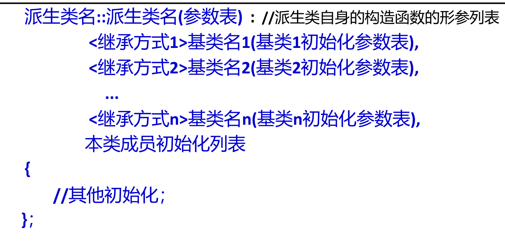

声明派生类时如不写继承方式,其默认的继承方式是private

```c++
class 派生类名 : 继承方式1 基类名1, 继承方式2 基类名2, ...
{
    // 派生类类体
};
//构造函数定义
派生类名::派生类名(参数列表) : 基类名1(参数), 基类名2(参数), ...
{
    // 派生类成员初始化
}
```

1. **调用所有基类构造函数**：派生类的构造函数必须调用所有直接基类的构造函数
2. **执行顺序**：基类构造函数的调用顺序**与派生类声明中基类的顺序一致**，与构造函数初始化列表中的顺序无关
   - 例如，如果声明为 `class D : public A, public B, public C { ... }`，则构造顺序是 A → B → C
   - 即使初始化列表写成 `D(...): B(...), C(...), A(...)`，执行顺序仍是 A → B → C
3. **参数列表**：派生类的参数列表必须包含所有基类构造函数所需的参数和派生类自身成员所需的参数

#### 多继承引起的二义性

可能造成对基类中某个成员的访问出现了不确定的情况，使得这种访问具有二义性

在多重继承中，派生类对基类成员访问在下列两种情况下可能出现二义性：

- 访问不同基类的相同成员时可能出现二义性
- 访问共同基类中成员时可能出现二义性

解决方法

- 使用作用域标识符
- 使用同名覆盖的原则
- 虚基类

#### 虚基类

二义性可通过虚基类解决，将共同直接基类设置为虚基类，这样从不同的途径继承过来的同名成员只有一个副本，这样就不会再会引起二
义性问题。

格式：**`class 派生类 : virtual 派生类名 基类名`**

虚基类的说明是用在定义派生类时，写在派生类名的后面

虚基类的构造函数按被继承的顺序构造，建立虚基类的子对象时，虚基类构造函数仅被调用一次。

### 类的多态

多态性，是指同一个事物具有多个状态

多态性的实现方式主要有4种：重载多态、强制多态、类型参数化多态和包含多态。

- 重载多态：**函数重载、运算符重载**都属于重载多态
- 强制多态：将一个变量的类型加以强制转换来满足某种操作要求，**强制类型转换就属于强制多态**
- 类型参数化多态：C++中的类模板是实现类型参数化多态的工具
- 包含多态：类族中定义于不同类中的同名成员函数的多态行为，主要是继承过程中通过虚函数来实现，本章介绍的虚函数属于包含多态。

#### 静态关联和动态关联

关联（binding）是指捆绑或连接的意思，即把两样东西捆绑在一起。就是确定调用的具体对象的过程，一般来说，**关联指把一个标识符和一个存储地址联系起来。**

- 静态关联：

  如果在编译程序时就能确定具体的调用对象，称为静态关联。

  一般通过**函数重载**和**运算符重载**来实现静态多态性。

- 动态关联

  如果在编译程序时还不能确定具体的调用对象，只有在程序运行过程中才能确定具体调用对象，称为动态关联

  一般通过类的继承关系和虚函数来实现动态多态性

#### 运算符重载

运算符重载通常是针对类中的私有成员进行操作，故运算符重载函数也应该能够访问类中的私有成员，所以运算符重载一般采用类的成员函数或友元函数来实现

- 重载为类的成员函数（非静态的）
- 重载为类的友元函数

运算符重载函数不能定义为**静态**的成员函数，因为静态的成员函数中没有this指针。

语法：

1. 在类内定义运算符重载函数

   <函数返回值类型> operator <重载运算符>( [<参数列表>] ){ … }

2. 在类外定义运算符重载函数

   <函数返回值类型> <类名>::operator <重载运算符> ( [<参数列表>] ){…}

#### 虚函数

为了实现派生类对象调用不同派生层次的同名函数，C++引入虚函数的概念，体现了**运行多态性**

虚函数是基类的成员函数，定义虚函数的格式如下：

virtual 函数类型 函数名(参数表)		//虚函数
{ 函数体;}

虚函数的作用就是实现动态多态性

- 在派生类中重新定义的函数应与虚函数具有**相同的形参个数和形参类型**。
- 如果在派生类中没有对虚函数重新定义，则它继承其基类的虚函数。

说明：

1. 虚函数是一个成员函数，在基类中用virtual声明，其在基类的实现可以在类外完成，不必再加virtual。
2. 派生类中与基类中虚函数同原型的成员函数，也一定是虚函数，在其定义中，关键字virtual可以被省略。换句话说，**虚函数是可以继承的。**
3. 虚函数必须是类的一个成员函数，不能是友元函数，不能是静态的成员函数，不能是内联函数
4. 在派生类中没有重新定义虚函数时，与一般的成员函数一样，当调用这种派生类对象的虚函数时，则调用的是其基类中的虚函数。
5. 可把析构函数定义为虚函数，但是，**不能将构造函数定义为虚函数**。
6. 虚函数与一般的成员函数相比较，调用时的执行速度要慢一些。

#### 虚函数的使用

在派生类中可以重新定义与基类同名的函数，必须通过指向基类的指针或基类对象的引用来调用虚函数，确定是调用基类同名函数，或者派生类同名函数，才能实现动态多态性。

1. 指向基类的指针变量名->虚函数名（实参表）
2. 基类对象的引用名.虚函数名（实参表）

1. 通过基类对象的指针

   定义一个基类对象指针。

   通过该指针变量调用虚函数。

   - 当该指针指向基类对象时：调用基类的同名函数
   - 当该指针指向派生类对象时：
     - 普通函数成员：自动调用基类成员
     - 虚函数成员：自动调用派生类成员

#### 虚析构函数

当派生类的对象从内存中撤销时一般先运行派生类的析构函数，然后再调用基类的析构函数

如果用new运算符建立了派生类的临时对象，对指向基类的指针指向这个临时对象，当用delete运算符撤销对象时，系统执行的是基类的析构函数，而不是派生类的析构函数，不能彻底完成“清理现场”的工作。

决的办法是将基类及派生类的析构函数设为虚函数，这时无论基类指针指的是同一类族中的哪一个类对象，系统会采用动态关联，调用相应的析构函数。

如果类的构造函数中有**动态申请**的存储空间，建议将析构函数定义为虚函数，以便实现**通过基类的指针或引用撤消派生类对象**时的多态性。

### 抽象类

#### 纯虚函数

有时，基类往往表示一种没有具体意义的抽象概念，它不可能为其虚函数提供具体的定义，故可以定义为纯虚函数。

纯虚函数的声明格式为：**virtual 函数类型 函数名(参数表) = 0;**

- 纯虚函数是一个在基类中声明的虚函数，它只有一个函数声明，并没有具体函数功能的实现，要求各派生类根据实际需要定义自己的版本
- 最后“=0”表示该虚函数没有任何具体实现，只是一个形式
- 不能创建含有一个或多个纯虚函数的对象，因为如果要进行函数调用，则纯虚函数是不会有任何回应的
- 纯虚函数不可以直接调用。

如果一个类中**至少有一个纯虚函数**，那么这个类被称为抽象类。抽象类中不仅包括纯虚函数，也可包括虚函数。

可以声明**指向抽象类的指针和引用**，此指针可以指向它的派生类，进而实现运行时多态性。
当用这种基类指针指向其派生类的对象时，必须在派生类中重载纯虚函数，否则会产生程序的运行错误。

## 文件读取

1. ifstream infile;//用于与一个输入文件建立联系。用于文件输入操作
2. ofstream outfile;//用于与一个输出文件建立联系，用于文件输出操作
3. fstream iofile; //用于与一个输入输出文件建立联系，用于文件的输入和输出操作

需要使用**`#include<fstream>`**

打开文件的方式有以下两种。
①使用open()函数。
②使用构造函数。

- infile.open("myfile1.txt"); //打开 myfile1.txt 用于读
- outfile.open("myfile2.txt"); //打开 myfile2.txt 用于写
- iofile.open("myfile3.txt", ios::in| ios::out);//打开 myfile3.txt 用于读写

使用构造函数同样也可以打开文件，与open()函数实现的功能一样。

```c++
ifstream 对象名("文件名","打开方式");
ofstream 对象名("文件名","打开方式");
fstream 对象名("文件名","打开方式");
```

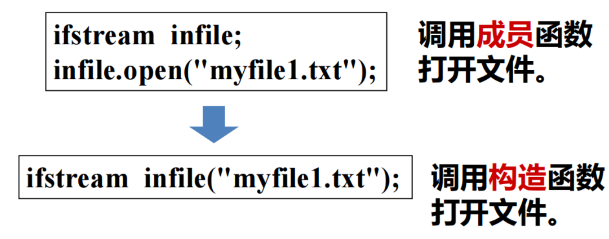

```c++
#include <iostream>
#include <fstream>
#include <string>
using namespace std;

int main() {
    string filename = "data.txt";
    ifstream ifs(filename);
    
    if (!ifs.is_open()) {
        cerr << "无法打开文件: " << filename << endl;
        return 1;
    }
    
    cout << "文件内容如下：" << endl;
    string line;
    while (getline(ifs, line)) {
        cout << line << endl;
    }
    
    ifs.close();
    cout << "文件读取完成！" << endl;
    return 0;
}
```

## 异常处理

1. throw语句

   throw<表达式>;

   当某段程序发现了自己不能处理的异常，就可以使用throw语句将这个异常抛掷给调用者。

   throw语句的使用与return语句相似，如果程序中有多处要抛掷异常，应该用不同的表达式类型来互相区别，表达式的值不能用来区别不同的异常。

2. try-catch语句

   ```c++
   try
   { 可能引发异常的语句序列；}
   //受保护代码
   catch(异常类型1)	//异常处理器1
   {处理代码1；}
   catch(异常类型2)
   {处理代码2；}	//异常处理器2
   ...
   
   catch(...)
   { 处理代码；
   }
   ```

   try语句后的复合语句是代码的保护段。

   - 如果预料某段程序代码(或对某个函数的调用)有可能发生异常，就将它放在try语句之后。
   - 如果这段代码(或被调函数)运行时真的遇到异常情况，其中的throw表达式就会抛掷这个异常。

### 异常接口声明

返回值类型 函数名（形参列表）throw（类型列表）；

例如：void fun() throw(A,B,C,D) ，这表明函数throw()能够且只能够抛掷类型A、B、C、D的异常。

若无声明，则可以抛出任意类型的异常

## 模板编程

在C++中，模板是实现**代码重用**机制的一种工具，它可以实现类型参数化，即直接将数据类型作为**类的参数**，这种机制称为泛型(genericity)。

在C++中，模板分为函数模板和类模板。

- 一个带类型参数的函数称为函数模板
- 一个带类型参数的类称为类模板。

### 函数模板

数模板的基本原理是通过**数据类型的参数化**（即：将数据类型作为函数的参数），将一组算法相同但所处理数据类型不同的重载函数凝练成一个函数模板。

函数模板（Template Functions）可以用来创建一个具有**通用功能**的函数，以支持**多种不同形参**，进一步简化重载函数的函数体设计

定义方法：
`template <class T> 或<typename T>`

1. template是定义函数模板的关键字，总是放在模板定义和声明的最前面。
2. `<class T>`或`<typename T>`必须用尖括号“<>”括起来，其中，“T”为类型参数，是一个虚拟的类型名。当使用函数模板时，该标识符会被替换为某种实际的数据类型（例如，int、char、float等）。

```c++
//example
template <class T>// 或 template <class T>
    T max(T x, T y){
    return (x>y)?x:y;
}
```

### 重载函数模板

重载函数模板便于定义类型参数，或者函数模板参数的类型、个数不相同所进行的类似操作。

```c++
template <typename T>
T Max(T x, T y)
{
	cout << "T Max(T x, T y)" << endl;
	return (x > y) ? x : y;
};

template <typename T>
T Max(T a[], int n)
{
	cout << "T Max(T a[], int n)" << endl;
	T temp;
	int i;
	temp = a[0];
	for (i = 1; i < n; i++)
		if (a[i] > temp)
			temp = a[i];
	return temp;
}
```

### 类模板

类是对一组对象的公共性质的抽象

类模板是对一批仅有成员的数据类型不同的类的抽象。

使用类模板可以为类声明一种模式，使得类中的：

- 某些数据成员
- 某些成员函数的参数、
- 某些成员函数的返回值，能取任意类型（包括基本类型和用户自定义类型）。

```c++
template <class T> // template <typename T>
    class 类名
{
    类成员声明
}
```

说明：

- 类模板的说明（包括成员函数定义）不是一个实实在在的类，只是对类的描述，称为类模板。
- 类模板的成员函数都是函数模板，实现语法和函数模板类似。
  - 如果在类中定义（作为inline函数），不需要特别说明
  - 如果在类外定义，则每个成员函数定义都要冠以模板参数说明，并且指定类名时要后跟类型参数。

template <模板参数表>
返回值类型 类名<模板参数标识符列表>::函数名（参数表）

### 模板的使用

类模板只是代表一种类型的类，**编译程序不会为类模板创建程序代码**，但是通过对类模板的实例化可生成一个具体的类（即模板类）和该具体类的对象。

`类模板名 <类型参数表> 对象名 ( 构造函数实参表);`

例：`Compare <int> cmp(4,7);`

注意：

在每个模板定义之前，不管是类模板还是函数模板，都需要在前面加上模板声明：template<typename/class T>

模板和函数模板在使用时，必须在名字后面缀上模板参数<T>，如：`Student<T>`。

## STL

STL 是一些常用数据结构（如链表、可变长数组、排序二叉树）和算法（如排序、查找）的模板的集合。

广义上讲，STL 分三类：

- 容器（container）
- 迭代器（iterator）
- 泛型算法（algorithms）

STL 详细地说可分为六大组件：

- 容器（container）：用于存储和组织数据的类模板，提供多种数据结构（如 vector、list、map 等）；
- 迭代器（iterator）：作为容器与算法的桥梁，提供统一的方式访问容器中的元素（类似指针）
- 算法（algorithms）：通用的操作数据的函数（如排序、查找、复制等），通过迭代器操作容器元素
- 仿函数（function object）：重载operator()的类 / 结构体，可像函数一样调用，用于定制算法的行为；
-  适配器（adaptor）：对其他组件（容器、迭代器、仿函数）进行转换或修饰，适配特定需求（如stack 是 deque 的适配器）
-  空间配置器（allocator）：负责容器的内存分配与释放，是容器底层的内存管理机制。

### 容器

容器（container）就是用来管理一组元素的通用的数据结构，是将单一类型的数据的聚集起来。

STL提供了多种不同类型的容器，如vector、list、deque、set、map等，用于存储和管理数据。这些容器提供了不同的特性和性能，可以根据具体需求选择合适的容器。

容器部分主要由头文件`<vector>、<list>、<deque>、<set>、<map>、<stack>、<queue>`组成。

容器按存储结构和功能特性可分为两大类：**序列式容器、关联式容器**，每类容器的实现原理和适用场景各不相同，具体分类及实现如下：

1. 序列式容器
   - vector（动态数组）
   - list（双向链表）
   - deque（双端队列）
   - array（静态数组，C++11 新增）
2. 关联式容器
   - 有序关联容器（基于红黑树，一种自平衡二叉搜索树）
   - 无序关联容器（C++11 新增，基于哈希表）

### 迭代器

迭代器（Iterator）是 C++ 中连接容器与算法的核心工具，本质是一种行为类似指针的对象，用于按顺序访问容器中的元素，同时屏蔽容器底层存储结构（如数组、链表、树等）的差异，是泛型编程的基础。

### 算法

算法部分主要由头文件`<algorithm>、<numeric>、<functional>`组成。提供了大约100个实现算法的函数模版。

算法常常**通过迭代器**间接地操作容器元素，而且通常会**返回迭代器**作为算法运算的结果。

### 仿函数（function object）

仿函数(functor)，就是使一个类的使用看上去像一个函数。其实现就是类中实现一个operator()，这个类就有了类似函数的行为，就是一个仿函数类了。

### 容器适配器

对已有容器进行封装，隐藏部分接口，提供特定的操作语义（如栈、队列），自身不直接实现存储，依赖底层容器。

### 空间配置器（allocator）

容器（如vector/list/map）本身不直接管理内存，所有内存的分配 / 释放、对象的构造 / 析构，都通过配置器完成；

### 匿名函数（lambda）

是 C++11 引入的匿名函数，可在代码中 “就地定义” 短小的函数逻辑，无需提前声明，尤其适合作为 STL 算法（如for_each）的 “临时操作函数”

`[capture-list] (parameter-list) mutable -> return-type { function-body }`

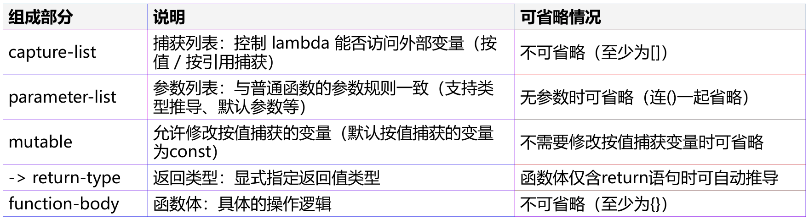


